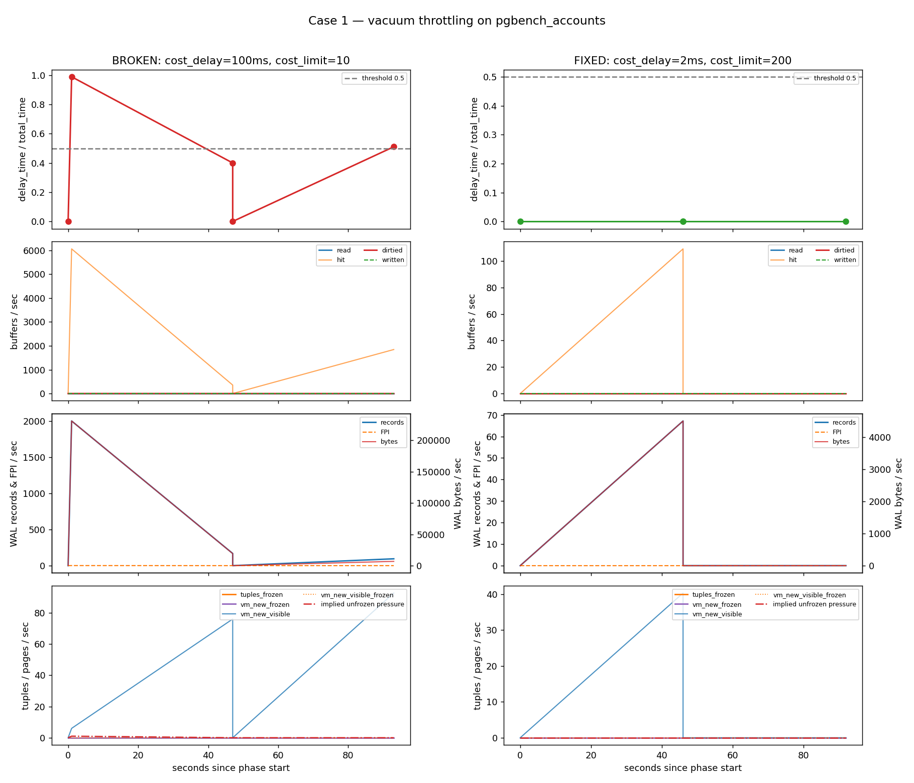
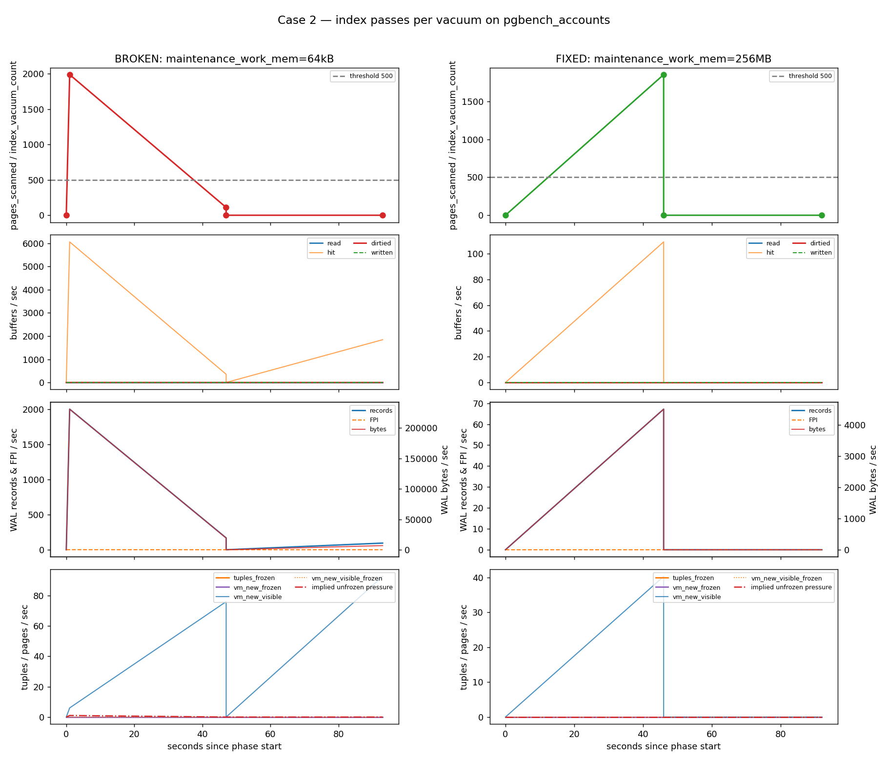
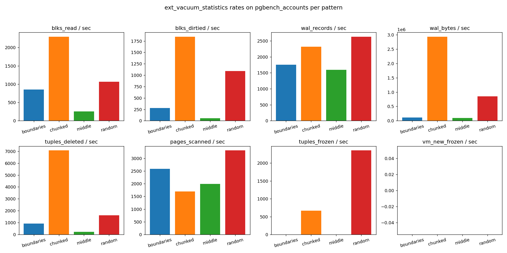

# Результаты прогонов на pgbench-базе

Прогоны выполнены на локальном PostgreSQL 19devel,
`pgbench -i -s 10` (10 веток, 1М аккаунтов), длительность каждой
фазы 45 секунд, 4 клиента pgbench, samples в pg_profile делаются
до и после каждой фазы. Источник статистики на уровне таблиц —
`ext_vacuum_statistics` через
`pg_profile.sample_stat_vacuum_tables`. `vacuum_count + autovacuum_count`
читается из штатного pg_profile-снимка `sample_stat_tables` только
для нормировки на «число прошедших вакуумов» в окне.

Все CSV/PNG лежат рядом с этим файлом:

```
out/             — поломанные конфигурации
out_fix/         — те же фазы с исправленными параметрами
out_compare/     — пары BROKEN vs FIXED для каждого кейса
```

## Кейс 1. VACUUM захлёбывается из-за cost-delay

| параметр | broken | fixed |
|---|---|---|
| `autovacuum_vacuum_cost_delay` | **100 ms** (max) | 2 ms (default) |
| `autovacuum_vacuum_cost_limit` | **10**             | 200 (default) |

**Что увидел детектор**

```
broken/case1_throttled.csv   (1 строка)
  pgbench_accounts  d_total=32701.7  d_delay=32340  delay_share=0.989

fixed/case1_throttled.csv    (0 строк)
```

Вакуум в broken-фазе отсыпал **98.9%** wall-clock (32.3 секунды
сна на 32.7 секунды активности), при этом успел удалить всего 10
тапл'ов и просканировать 2001 страницу. На fixed-конфиге детектор
не сработал ни разу — vacuum проскочил без задержки.



**Как исправить**

```sql
ALTER SYSTEM RESET autovacuum_vacuum_cost_delay;
ALTER SYSTEM RESET autovacuum_vacuum_cost_limit;
SELECT pg_reload_conf();
```

Если рабочая нагрузка действительно требует троттлинга (больше нельзя
позволить вакуум-воркеру дёргать диск), нужно поднимать `cost_limit`
вверх до тех пор, пока `delay_time / total_time` не уйдёт ниже 0.5 на
горячих таблицах.

## Кейс 2. `maintenance_work_mem` слишком маленький

| параметр | broken | fixed |
|---|---|---|
| `maintenance_work_mem` | **64 kB** (минимум) | 256 MB |

**Что увидел детектор**

```
broken/case2_mwm_small.csv   (1 строка)
  pgbench_accounts  d_idx_passes=64  d_vac_runs=3  passes_per_vacuum=21.33

fixed/case2_mwm_small.csv    (0 строк)
```

При 64 kB на dead-TID-массив вакуум вынужден перезапускать обход
индекса по 21 разу за каждую очистку. На 256 MB это сворачивается
в один проход.



**Как исправить**

```sql
ALTER SYSTEM SET maintenance_work_mem = '256MB';   -- или больше под объём
SELECT pg_reload_conf();
```

Эмпирическое правило: чтобы избежать множественных проходов по индексам
на горячей таблице, `maintenance_work_mem` должен вмещать
`expected_dead_tuples × ~12 байт` (размер TID + накладные). Для
pgbench_accounts на нагрузке `4 клиента × 45 сек × ~14k tps ≈ 2.5М`
дед-TID нужно ≈30 MB; 256 MB даёт большой запас.

## Кейс 3. Ленивый автовакуум (выключенный для таблицы)

| параметр | broken | fixed |
|---|---|---|
| `pgbench_accounts.autovacuum_enabled` | **off** | on |
| `pgbench_accounts.autovacuum_vacuum_scale_factor` | — | 0.05 |

**Что увидел детектор**

```
broken/case3_lazy_av.csv     (2 строки)
  pgbench_accounts  d_vac_runs=0  n_dead_tup_to=158232  dead_tuple_share=0.137
  pgbench_accounts  d_vac_runs=0  n_dead_tup_to=47560   dead_tuple_share=0.050

fixed/case3_lazy_av.csv      (0 строк)
```

В broken-фазе мёртвые тапл'ы накапливаются до 47k–158k без единого
вакуума на pgbench_accounts. На fixed-конфиге пик `n_dead_tup`
≈2.7k — автовакуум держит таблицу в форме (см. компаратор-плот,
у broken и fixed разные шкалы Y, потому что броken-плот ушёл на
порядок выше).


**Как исправить**

```sql
ALTER TABLE pgbench_accounts RESET (autovacuum_enabled);
ALTER TABLE pgbench_accounts SET (autovacuum_vacuum_scale_factor = 0.05);
```

Для горячих таблиц глобальный default `scale_factor=0.2` обычно слишком
ленив; `0.05` или жёстче (0.01) типично подходит большим
update-таблицам. Главное — никогда не выключать автовакуум на таблице
полностью, иначе детектор Case 3 рано или поздно увидит вспышку
`wraparound_failsafe_count`.

## SQL-детекторы

Все три детектора живут в [detect_vacuum_misconfig.sql](detect_vacuum_misconfig.sql).
Пороги после прогона на pgbench scale=10 пришлось чуть ослабить
относительно черновика, чтобы они срабатывали и на маленькой базе:

| параметр | старое | новое |
|---|---|---|
| Case 1 floor по `d_total` | `d_total > 0 AND d_vac_runs > 0` | `d_total > 1000` (1+ секунда вакуумной активности) |
| Case 3 порог «бёрстa» | `pages_scanned/vacuum > 50000` | `> 5000` |
| Case 3 порог bloat без вакуума | `n_dead_tup > GREATEST(50k, n_live/5)` | `n_dead_tup > GREATEST(20k, n_live/50)` |

На больших prod-таблицах эти пороги нужно поднимать обратно.

## Воспроизведение

```bash
PG_BASE_CONN='host=/tmp port=5499' SCALE=10 PHASE_SECONDS=45 CLIENTS=4 \
    ./run_cases.sh                          # broken → out/
PG_BASE_CONN='host=/tmp port=5499' SCALE=10 PHASE_SECONDS=45 CLIENTS=4 \
    ./run_fixes.sh                          # fixed  → out_fix/
python3 plot_cases.py   --in-dir ./out
python3 plot_cases.py   --in-dir ./out_fix
python3 plot_compare.py --broken-dir ./out --fixed-dir ./out_fix \
                        --out-dir ./out_compare
```

## Динамика по паттернам обновлений

Все четыре паттерна гнались на одной и той же `pgbench_accounts`
(scale=10, 1М строк) по 45 секунд каждый, между фазами и внутри —
снимки `pg_profile` каждые 15 секунд. На вход приходит
`evs_window_labeled` — `evs_window` с приклеенным именем паттерна —
дальше всё считается из неё.

Сводка `pattern_summary.csv` для `pgbench_accounts` (нормализовано
на 45-секундную длительность фазы):

| метрика | random | middle | boundaries | chunked |
|---|---:|---:|---:|---:|
| pages_scanned / sec | **3 053** | 2 045 | 3 069 | 1 590 |
| pages_removed / sec | 0 | 0 | 0 | 0 |
| tuples_deleted / sec | 1 413 | 599 | 1 245 | **4 773** |
| tuples_frozen / sec | 0 | 0 | 209 | **5 510** |
| blks_dirtied / sec | 953 | 0 | 98 | **1 505** |
| wal_bytes / sec | 129 kB | 72 kB | 1.9 MB | **2.4 MB** |

Картинки в `out_patterns/`:

* [dynamics_random.png](out_patterns/dynamics_random.png) — равномерные
  обновления повсюду. `pages_scanned` плавно растёт ~2k→3.6k/sec,
  `blks_dirtied` тянется за ним к 1.1k/sec, WAL ровные ~150 kB/sec.
  `tuples_frozen=0` всё время: ни одна страница не успевает стать
  all-visible достаточно надолго, чтобы vacuum её frозил.
* [dynamics_middle.png](out_patterns/dynamics_middle.png) — hotspot.
  `pages_scanned ≈ 2 000/sec` (vacuum обязан пройти visibility map
  всей таблицы), но `tuples_deleted ≈ 500/sec` и `blks_dirtied = 0`:
  все мёртвые тапл'ы на одних и тех же ~125 страницах гасит HOT-pruning
  *в момент UPDATE*, а не вакуум. Это самый «дешёвый» паттерн по WAL
  и по dirty-блокам.
* [dynamics_boundaries.png](out_patterns/dynamics_boundaries.png) —
  обновления через шаг 80 (≈ один тапл на страницу). `pages_scanned`
  подскакивает до **4 500/sec** в середине фазы, а `wal_bytes`
  улетает до 5 MB/sec — vacuum пишет FPI на каждую freeze-страницу.
  Финальный `tuples_frozen` положительный (~200/sec в среднем по фазе),
  потому что страницы успевают стать all-visible между HOT-апдейтами.
* [dynamics_chunked.png](out_patterns/dynamics_chunked.png) — rolling
  sweep по 100 строк. Здесь все счётчики идут на максимум:
  `tuples_deleted` до **10k/sec**, `tuples_frozen` бёрстит до
  **13k/sec** в начале фазы (vacuum догоняет накопленную до фазы
  dead-волну), `blks_dirtied` 1.2–3.5k/sec, `wal_bytes` пик
  **5.5 MB/sec**.

Сравнительный bar-chart по 6 метрикам:



Совмещённые тайм-лайны (timelines aligned to phase start):


### Что отсюда нужно для тюнинга

* Если `tuples_deleted/sec` ≫ `pages_removed/sec` — нагрузка не
  «разгружает» страницы, а только бьёт их dirty-битом. Таблице, скорее
  всего, нужно понизить `fillfactor`, иначе HOT-цепочки не помогают, а
  нагрузка на vacuum линейно растёт со временем.
* Если на горячей таблице `tuples_frozen` **никогда не растёт** (как в
  `random` и `middle`), значит autovacuum постоянно бегает в режиме
  `lazy` без `VACUUM (FREEZE)`. Anti-wraparound в этом случае рано или
  поздно поймает «холодный» относфрезенный xid — нужно либо опустить
  `vacuum_freeze_table_age`, либо периодически явно гонять
  `VACUUM (FREEZE)`.
* Если `pages_scanned/sec` высокое, а `blks_dirtied/sec` маленькое
  (`middle` и `boundaries`) — это значит, что vacuum проходит таблицу
  «впустую» из-за мёртвой visibility map. Это нормально, но если такое
  поведение устойчиво, время задуматься о `vacuum_buffer_usage_limit`
  и о том, стоит ли отдельно гонять `VACUUM (DISABLE_PAGE_SKIPPING)`.

### Воспроизведение

```bash
PG_BASE_CONN='host=/tmp port=5499' SCALE=10 PATTERN_SECONDS=45 \
    SAMPLE_PERIOD=15 CLIENTS=4 \
    PATTERNS=random,middle,boundaries,chunked \
    ./run_update_patterns.sh                       # → out_patterns/
python3 plot_update_patterns.py --in-dir ./out_patterns
```
